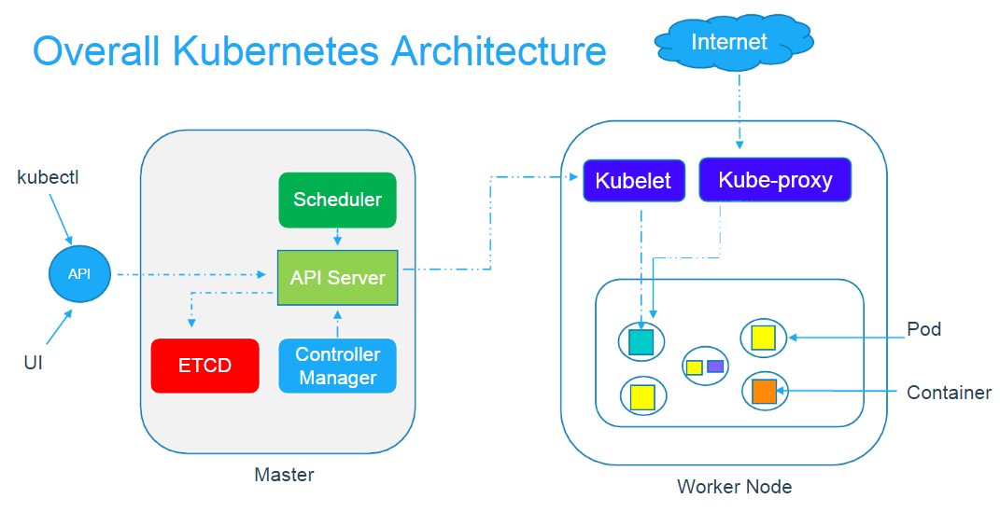

# Azure Kubernetes Service (AKS)

So far, we have been using minikube to host our Kubernetes clusters, and that's great during development and testing. However, when it comes to production, we need a cloud-based, scalable, and highly available solution. Implementing this out of scratch on our own server would be very challenging, and make little sense, which is why all major cloud providers have an implementation that allows you to run your Kubernetes cluster on the cloud. AKS helps achieve this to some degree.

## What is AKS?

To start understanding exactly what AKS is, let's backtrack to the beginning. If you've forgotten the Kubernetes architecture, perhaps this is a good time to revisit [the lesson](https://collabnix.github.io/kubelabs/Kubernetes_Intro_slides-1/Kubernetes_Intro_slides-1.html).

Consider the following architecture, which is how Kubernetes works:

You have the master node which handles and provisions worker nodes, which do the actual work of holding pods. Previously, when we used minikube, we ran everything on our local machine. However, now, we can move part of this to AKS. One thing to note is that AKS does not act as an alternative to the entire Kubernetes architecture, rather, it only replaces the master node. As such, AKS is free and only requires a normal Azure subscription.
