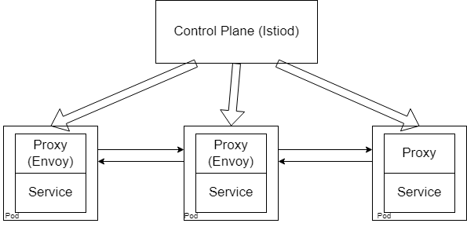

# What is Istio?

Istio is a type of service mesh. To understand better, let us take a look at the diagram from the previous section.


This is the generic service mesh architecture that all service meshes follow. Therefore Istio has all the above components. Istiod is used as the control plane, while Envoy is used as the proxy.



## Istio Configuration

The major advantage of service meshes that we have been repeatedly mentioning is that it tacks on to your existing cluster without intruding on your existing resources. As with most other Kubernetes resources, Istio can be configured using Yaml files. It also supports Custom Resource Definitions so that you have extended access to the Kubernetes API.

### Configuring CRD's

One major thing you may want to control inside your cluster is the inter-cluster traffic. What pods can communicate with each other, how the communication should happen, and how many times it should try before timing out. These are all things that can be addressed by Istio and can use CRDs to help. To be more specific, two main CRDs can achieve this: the Virtual Service and the Destination Rule.

**Virtual service:** This deals with the intricacies behind how the actual routing is done to the destination.

**Destination Rule:** This deals with what to do when the communication has been received. How will we get this communication over to the services, what policies need to be enforced, etc...

Remember that Istio uses Envoy as a proxy. So our CRDs won't work out of the box here. But we don't have any additional steps to take since Istio, or rather, Istiod will handle this conversion for us. It will turn these high-level routing rules into Envoy-specific configurations, which will then be sent to the Envoy proxies. All without us having to handle any part of the configuration. Once this is done, the Envoy proxies will be able to communicate with each other based on the policies and rules set aside for them without involving Istiod.

## What else does Istio offer

If you are working in a large organization that has huge clusters that increase in size all the time, having all these rules and policies enforced into each new service can be a hassle. However, Istio provides service discovery, which means that if you were to introduce a new service, Istio will passively discover the service and apply the necessary configuration without you having to do anything yourself.

Remember during the microservices section, we discussed the security risks associated with a microservice architecture. Istio addresses this problem by acting as a certificate authority that manages the certificates between microservices in a cluster and enables secure TLS communication among them. Since the interactions between the pods are restricted, monitored, and have policies enforces, this means an attacker would not be able to move around the cluster freely, even if they managed to breach the cluster's security.

Next, there are metrics. Note that with this architecture, all communications between pods go through the Envoy proxies. This means that the proxies are an excellent source of metrics, and Istio uses this to its advantage. This means the proxies gather metrics information that can be consumed by other services such as Prometheus, which adds another layer of logging for your cluster.

Istio also offers an Ingress gateway. If you don't fully understand what an Ingress is, then head over to the [Ingress section](./../Ingress101/README.md) and have a read-through. The ingress gateway supplied by Istio is similar to a regular ingress gateway (such as the one provided by [nginx](https://docs.nginx.com/nginx-ingress-controller/)). The gateway runs as a pod in your cluster and plays the role of a load balancer by accepting connections to the cluster and then distributing the connections across the microservices.

## Overview

Here's a quick wrap-up of the whole process:

1. The request from the user comes to the Istio cluster, which then gets rerouted to your microservice (based on load).
2. The request reaches the Envoy proxy related to that microservice (not the pod), where it undergoes any policies, rules, etc... set in place
3. The request is handled by the Envoy proxy and redirected to the pod. Note that since the proxy is a sidecar container attached to your pod, it can do this efficiently via localhost.
4. If there is additionally communication that needs to be done, the pod will send that information to its proxy, where step 2 will happen again
5. The Envoy proxy will forward the request to the Envoy proxy of the appropriate destination microservice, and everything from step 2 onwards will repeat

Note that the control plane is not included in this flow. This is because the requests don't actually go through the control plane, and instead, the proxies communicate with each other directly, which reduces latency. However, the control plane is actively involved in metrics collection while this flow is happening.

## Setting up Istio

Naturally, you need to have a Kubernetes cluster set up first. You can either use a cluster that you already have, or an application like minikube to get a cluster up and running on your local machine. The minikube [getting started](https://minikube.sigs.k8s.io/docs/start/) guide is all you need to set it up.

To get a working form of Istio up and running, first, download Istio from its official [GitHub page](https://github.com/istio/istio/releases/tag/1.14.1). Once you have finished setting it up, you should be able to use Istio on the CLI in the same way you use Kubernetes using ```istioctl```. Previously, I mentioned that attaching Envoy proxies to each new deployment are unnecessary since you can get Istio to handle that for you, and you can go ahead and set up that configuration right away:

```
kubectl label namespace default istio-injection=enabled
```

And that's about all it takes to set up istioctl. Now, let's use Istio in an actual project. We will be using the [Bookinfo Application](https://github.com/istio/istio/tree/master/samples/bookinfo) sample provided by Istio, so make sure you clone the entire repository first. There are four microservices and three versions of one microservice. The architecture of the system is as below:


Please refer to the [sample documentation](https://istio.io/latest/docs/examples/bookinfo/) for more information on this system. True to the use case of service meshes, this application has been created with different languages at each point in the architecture. The first step is to deploy the application to your cluster:

```
kubectl apply -f samples/bookinfo/platform/kube/bookinfo.yaml
```

Ensure that all the pods and services are up and running using this command:

```
kubectl exec "$(kubectl get pod -l app=ratings -o jsonpath='{.items[0].metadata.name}')" -c ratings -- curl -sS productpage:9080/productpage | grep -o "<title>.*</title>"
```

Next, you need to expose the application externally, and you do that by introducing an Istio gateway:

```
kubectl apply -f samples/bookinfo/networking/bookinfo-gateway.yaml
```

If we were to take a closer look at the [file](https://github.com/istio/istio/blob/master/samples/bookinfo/networking/bookinfo-gateway.yaml), you will see that it is a resource of type ```Gateway```, and connect over HTTP port 80. There is also a resource of type ```VirtualService``` that defines four routes corresponding to four pages of the application.

```yaml
- uri:
        exact: /productpage
    - uri:
        prefix: /static
    - uri:
        exact: /login
    - uri:
        exact: /logout
    - uri:
        prefix: /api/v1/products
```

Run ```istioctl analyze``` to verify that there were no problems with the resource deployment. Now that you have exposed your application externally, get the application host and port so that you may access the resources. This step varies depending on where you run your Kubernetes cluster. If you use minikube, then you should first enable its tunneling feature:

```
minikube tunnel
```

If you are using something else to host your cluster, you can run:

```
kubectl get svc istio-ingressgateway -n istio-system
```

This will determine whether your cluster supports external load balancers. If it does, then you can set the ingress ports and host (this is also applicable if you are using minikube):

```
export INGRESS_HOST=$(kubectl -n istio-system get service istio-ingressgateway -o jsonpath='{.status.loadBalancer.ingress[0].ip}')
export INGRESS_PORT=$(kubectl -n istio-system get service istio-ingressgateway -o jsonpath='{.spec.ports[?(@.name=="http2")].port}')
export SECURE_INGRESS_PORT=$(kubectl -n istio-system get service istio-ingressgateway -o jsonpath='{.spec.ports[?(@.name=="https")].port}')
```

and you're done. If your cluster doesn't support external load balancers, then you still need to set the ports:

```
export INGRESS_PORT=$(kubectl -n istio-system get service istio-ingressgateway -o jsonpath='{.spec.ports[?(@.name=="http2")].nodePort}')
export SECURE_INGRESS_PORT=$(kubectl -n istio-system get service istio-ingressgateway -o jsonpath='{.spec.ports[?(@.name=="https")].nodePort}')
```

After which you need to follow the steps listed in the [official documenatation](https://istio.io/latest/docs/setup/getting-started/#determining-the-ingress-ip-and-ports) according to your specific cluster host.

Finally, set up the gateway URL. This consists of the external host and port that you set up in the previous step and can be used to access your cluster.

```
export GATEWAY_URL=$INGRESS_HOST:$INGRESS_PORT
```

Istio integrates with several third-party software to provide additional features. You can find the list of software [here](https://istio.io/latest/docs/ops/integrations/). These help you get a better overview of your mesh and should be installed depending on your needs. In this case, we will be installing a [predefined list of addons](https://github.com/istio/istio/tree/master/samples/addons) which includes:

- Prometheus
- Prometheus Operator
- Grafana
- Kiali
- Jaeger
- Zipkin

Install all the above using:

```
kubectl apply -f samples/addons
kubectl rollout status deployment/kiali -n istio-system
```

Out of the above applications, we will be using Kiali first. [Kiali](https://kiali.io) is a dashboard specifically designed to act as a management console for Istio, and can provide you insight on the status of your service mesh such as health, status, security, tracing, etc... To open up this dashboard, use:

```
istioctl dashboard kiali
```

Since you also have Grafana installed, you could take a look at the Grafana dashboard as well. The versions of Prometheus installed here to provide you will all the usual monitoring features, except they are now added in as part of the service mesh, and not installed to the cluster directly. As we spoke about at the start, this allows Prometheus to have a much better overview of the entire system and collect logs from the proxies, which act as the gateway between all pods. You will also notice that [Jaeger](https://istio.io/latest/docs/ops/integrations/jaeger/) has been installed, which is an end-to-end tracing system suited for distributed systems that perform complex transactions that could go wrong somewhere. Instead of digging through hundreds of log files to see where the problem occurred, you could instead use Jaeger to trace the transaction to troubleshoot the problem.

Finally, we have [Zipkin](https://istio.io/latest/docs/tasks/observability/distributed-tracing/zipkin/), which, similar to Jaeger, helps with transaction tracing. Since you already have the Bookinfo application running, as well as Zipkin deployed, let's see the Zipkin tracing dashboard in action. In the same way, we opened the Kiali dashboard, and open up Zipkin:

```
istioctl dashboard Zipkin
```

Since you need to generate trace information to actually see anything on Zipkin, you should visit ```http://$GATEWAY_URL/productpage``` on your browser a couple of times. Alternatively, use curl:

```
for i in $(seq 1 100); do curl -s -o /dev/null "http://$GATEWAY_URL/productpage"; done
```

From the dashboard, select serviceName -> productpage.default and click on the search button. You should get ```ISTIO-INGRESSGATEWAY``` as a result, which should show you detailed trace data for the requests you just performed.

You should now be able to see a comprehensive overview of your Istio cluster. You are now done with a basic implementation of Istio, and you have the tools required to build your own Istio integrated clusters. If you want to dive deeper into Istio, you could take a look at the [various tutorials](https://istio.io/latest/docs/setup/getting-started/#next-steps) provided by Istio.

## Cleanup

Once you're done playing around with the sample, you can clean up everything using:

```
killall istioctl
samples/bookinfo/platform/kube/cleanup.sh
```

Then check if everything is really gone:

```
kubectl get virtualservices   
kubectl get destinationrules 
kubectl get gateway           
kubectl get pods              
```

So that brings us to the end of Istio. Next, we'll talk about an equally competent contender: Linkerd.

[Next: Linkerd](./what-is-linkerd.md)