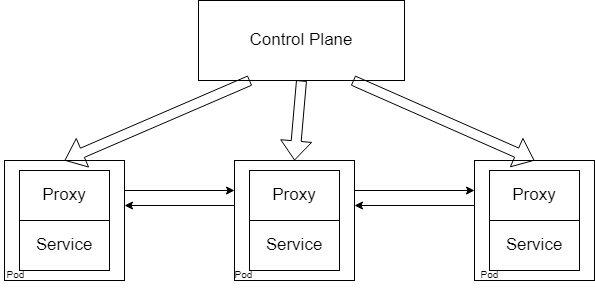

# What is a service mesh?

Before we start talking about service meshes, we need to consider the reason why service meshes exist at all. For this, we must dig into the limitations of microservices. Now, we are always under the impression that microservice architectures are always superior to monolithic ones. We don't really think about how the reverse might also be true. With microservices, the entire application is fragmented into many different services that have to work with each other. This means that the services communicate with each other directly, and things such as enforcing policies over pod communication become impossible on a large scale. Additionally, this architecture has some severe security drawbacks since any resources inside the cluster have unrestricted access to anything within the same cluster. So even though you may have some security measures in place to prevent unauthorized access to the cluster, once an attacker breaches those defences, they are free to do as they wish. This is obviously a huge problem when clusters hold sensitive data such as passwords or credit card information. The basic problem is that there is no abstraction. That is to say, pods should only contain their own business logic. It shouldn't care about the logic of how inter-pod communication happens, or how security within the cluster should be maintained. Because once you start attaching this logic to a single pod, you have to attach it to every pod, which makes everything unnecessarily complicated.

Service meshes provide this essential base infrastructure to your cluster. Things such as managing traffic, setting policies and security to your cluster, ensuring the robustness of the cluster, etc... Imagine you had sensitive data flowing through your cluster. You would obviously need to encrypt this data for added security. Normally, you would have to do major changes to your application and infrastructure to pull this off. However, with service meshes, that is no longer necessary since the default option provided by service meshes can achieve the same goal without touching your infrastructure.

When introducing new features to your application, it is always good to have canary, nightly, and staging version to ensure that everything is working fine before releasing it to stable. Instead of suddenly replacing your stable system with a brand new service, you could use service meshes to slow send a certain percentage of your traffic to your new service. Eventually, this percentage will reach 100%, and then you can get rid of the old service. This is a phased rollout and is fully supported by service meshes.

If you have a service that gets popular, then load balancing and traffic management are a must. After all, no one is going to use your service if it takes forever to load. You also need to ensure that your service is protected from Denial of Service (DDoS) attacks, and implementing all these security features can be a hassle.

Finally, good levels of logging and monitoring are crucial to ensuring that your system is stable in the long run. If your application fails at any point, then you must have a good method to monitor and log these failures so that you may find the root cause of these issues. This is yet another place where service meshes can help.

If you are using service meshes then all of the above features can be easily implemented onto your cluster. Useful, don't you think?

# How does it work?

The service mesh architecture works by attaching to the existing cluster in a non-intrusive way. As such, they do not go around interfering with existing runtime functionality, rather it takes away existing logic that enables services to communicate with each other into their own application, after which they handle the monitoring, communication, security, etc... of these services. This means that all this functionality is abstracted away from the service and into a more logical structure where the service mesh handles everything for the service.

A service mesh typically has two components: the data plane and a control plane. The data plane is made of several lightweight proxies **which attach to your pods***, while the control plane consists of the services that form the service mesh. As such, the control plane handles the configuration of proxies, policies, certificates, and metrics. This allows it to enforce any policies that are required (such as communication policies or monitoring policies), which in turn enforce that policy into the cluster. All this is achieved via sidecar containers.

### Sidecar containers

Imagine you have an algorithm that converts certain files to a different file type. This algorithm would be complex and written in a scripting language such as Python. Now, you want to use this algorithm to complement a container that was built with Java. This means that you would have to spend time and resources re-writing that algorithm in Java, instead of moving forward with the development process, thereby decreasing efficiency. This is where sidecar containers come in. They run alongside your existing container (hence the name sidecar) and share the same resources, authorizations, networks, etc... while being a completely different container. This means that this sidecar container can have your Python algorithm in it and still work nicely alongside your Java container.

This isn't the only use for sidecar containers. Since the sidecar container shares all sorts of resources with the main container, it can continuously pull logs and other metrics, as well as enforce security on your existing container with ease. This makes it a powerful tool, and ideal for use by a service mesh.

However, it is not recommended to use sidecar containers freely, these are advanced paradigms that can easily make your cluster unnecessarily complicated.

# Types of service meshes

There are several service meshes out there, and we will be focussing on the two most prominent ones. [Istio](https://istio.io/latest/), and [LinkerD](https://linkerd.io). So let's go ahead into a deep dive of Istio first.

[Next: Istio](./what-is-istio.md)
